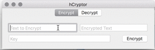
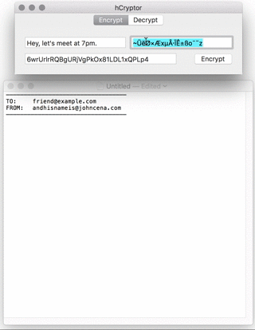
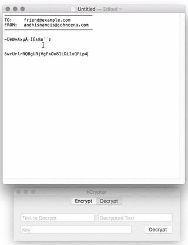

# hCrypto

## A simple OS X app that encrypts & decrypts your message

NSA, NIS, Eve... We've all heard about those eavesdroppers who want to keep track of where we go, what we do, and whom we interact with. We have never consented but they are invading our privacy.

hCrypto uses either a randomly-generated key or a user-given key to encrypt the message. You can either share/agree on a key with your friend via a separate channel, then exchange message from there on.

# Usage

Enter your message to encrypt.

Send it to your friend, with the key:

Anyone who gets this message, initially, will consider this message as either broken encoding (from Unicode converting and whatnot).

Your friend can now decrypt your message, using the key provided to you (using different channel to share key is highly recommended):

# Patch notes

- v1.0: Initial release

# Upcoming enhancements

- Encrypt an entire file!
- Compress the encrypted message!